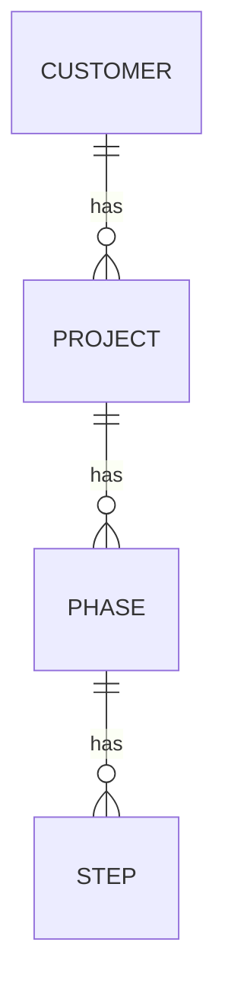

# Veri Modeli

> **Durum:** Şablon — F1-00'da `planner` (VERİ MODELİ modu) tarafından doldurulur, Murat onaylar.
> Onaydan sonra her şema değişikliği önce bu dosyada yapılır, sonra migration yazılır (`reviewer` kontrol eder).
> Kısıtlar: `docs/adr/0002-pg-mem-and-postgres-parity.md` — trigger / PL/pgSQL / RLS / extension yok; iş kuralları servis katmanında.

**Sürüm:** v0 · **Son güncelleme:** YYYY-MM-DD · **İlgili migration aralığı:** 0001–00NN

---

## 1. Erişim desenleri
Şema bu sorgulardan geriye doğru tasarlanır. Her satır parity job'ında `EXPLAIN` ile ölçülecek adaydır.

| # | Ekran / iş | Sorgu özeti | Filtre & sıralama | Tahmini satır (taranan → dönen) | Kritik mi? |
|---|---|---|---|---|---|
| Q1 | Proje listesi | projeler + aktif aşama + ilerleme + sağlık + açık uyarı sayısı | CSM, sağlık, aşama · Go-Live tarihi | 150 → 50 | ✔ |
| Q2 | Bana atananlar | kullanıcıya atanmış adım + aksiyon + uyarı | sahip = ben, açık · termin | 15.000 → 30 | ✔ |
| Q3 | Proje detayı | aşamalar → adımlar → aksiyonlar | proje id | 300 → 300 | |
| Q4 | Müşteri geçmişi | toplantılar + audit birleşik zaman çizelgesi | müşteri, tür, kullanıcı, tarih aralığı · tarih desc | 500.000 → 50/sayfa | ✔ |
| Q5 | Uyarı hesaplama | 14 uyarı tipi (spec tablosu) | açık kayıtlar, termin/iş günü | … | ✔ |
| Q6 | Haftalık müşteri raporu | son 7 gün, yalnızca `is_customer_visible` | proje, tarih aralığı | … | |
| Q7 | İç yönetim raporu | tüm projeler, dönem | dönem | … | |
| Q8 | AI Insight bekleyenler | görünür projelerin bekleyen önerileri | proje, kaynak, tür · tarih desc | … | ✔ |
| Q9 | İşçi: kanal/posta kutusu imleci + dış mesaj tekrar kontrolü | `external_id` ile var mı | kaynak + external_id | … | ✔ |
| … | | | | | |

## 2. ERD

## 3. Tablolar
Her tablo için:

### `<table_name>`
**Amaç:** …
| Kolon | Tip | Null | Varsayılan | Kısıt / FK | Not |
|---|---|---|---|---|---|
| id | uuid | no | (uygulama üretir) | PK | |
| … | | | | | |
| created_at | timestamptz | no | now() | | |
| updated_at | timestamptz | no | now() | | servis günceller |
| created_by | uuid | no | | FK users | |
| deleted_at | timestamptz | yes | | | soft delete (INV-03) |

**Index'ler:** `(project_id, status)` — Q2 · …
**Audit kapsamı:** evet / hayır (neden)
**Müşteriye görünür alanlar:** … (INV-12)

## 4. Standartlar
- Kimlik: `uuid`, uygulamada `crypto.randomUUID()` ile üretilir (pg-mem'de `gen_random_uuid()` extension'ı gerekmez).
- Zaman: anlık olaylar `timestamptz`; plan/termin tarihleri `date`. İş günü ve saat dilimi hesapları yalnızca `packages/shared/business-days` (INV-13).
- Enum: `text` + `CHECK (col IN (…))`; değerler `packages/shared/enums` ile birebir. Admin'in yönettiği listeler (modül, satışçı, keşif sorusu) ayrı tablo.
- Ortak kolonlar: `id, created_at, updated_at, created_by, deleted_at`.
- Soft delete ile uyumlu tekillik: <F1-00'da karar — pg-mem kısmi index destekliyorsa `WHERE deleted_at IS NULL`, desteklemiyorsa servis kontrolü + parity'de kısmi index (`pg-only`)>.
- Adlandırma: tablolar çoğul `snake_case`, FK `<tekil>_id`, index `idx_<tablo>_<kolonlar>`.

## 5. Projeye özgü kararlar
| # | Konu | Seçenekler | Karar | Gerekçe |
|---|---|---|---|---|
| D1 | Şablon sürümleme ve projeye kopyalama | | | |
| D2 | Adım ve aksiyon: tek tablo mu iki tablo mu | | | |
| D3 | Doküman bağlama (proje / toplantı / adım) | | | |
| D4 | "Top kimde" geçmişi ve bekleme süresi | | | |
| D5 | Audit yapısı (alan satırı vs jsonb diff) ve müşteri geçmişi sorgusu | | | |
| D6 | Uyarılar: anlık hesap vs saklanan uyarı + durum | | | |
| D7 | Tatil takvimi | | | |
| D8 | Erişim bilgisi şifreli alanları (iv, tag, ciphertext, key_version) | | | |
| D9 | Projeye atanmış kullanıcılar (`project_members`) | | | |
| D10 | Oturum tablosu (`sessions`: token_hash, expires_at, last_seen_at, revoked_at) | | | |
| D11 | AI önerisi: `proposed`/`current` alanları jsonb mi, tür başına kolonlar mı; kaynak birleştirme (aynı hedefe birden çok mesaj) | | | |
| D12 | Entegrasyon ayarları: tek satırlı ayar tablosu mu, anahtar-değer mi; şifreli secret alanları | | | |
| D13 | Uyarı durumu: hesaplanan uyarı anahtarı (tip + kayıt) + erteleme/kapatma kaydı (mockup `alertStates` yapısı) | | | |
| D14 | Sıralı akış alanları: aşama/adım `dependency`, `duration_days`, `activated_at`, `locked` durumu; şablonda aynı alanlar | | | |
| D15 | Adım tamamlama: `completion` (manual/data/meeting), koşul anahtarı, `meeting_type`; toplantı `status`; uyarlama kontrol listesi | | | |
| D16 | Haftalık rapor: snapshot (jsonb) + düzenlenebilir alanlar + gönderim bilgisi | | | |

## 6. Hacim varsayımı (3 yıl)
| Tablo | Tahmini satır | Büyüme |
|---|---|---|
| customers | 150 | |
| actions | 15.000 | |
| audit_log | 500.000 | en hızlı büyüyen; Q4'ün index'i kritik |

## 7. pg-mem riskleri
pg-mem'de desteklenmediği veya farklı davrandığı bilinen / şüphelenilen her yapı burada listelenir ve parity testine bağlanır.
| Yapı | Nerede | Risk | Parity testi |
|---|---|---|---|

## 8. Parity'de ölçülecek kritik sorgular
| Sorgu | Hedef süre (parity verisinde) | Beklenen plan (index kullanımı) |
|---|---|---|
| Q1 | < 50 ms | idx_… |

## 9. Açık sorular
- …

## Değişiklik geçmişi
| Sürüm | Tarih | Değişiklik | Görev |
|---|---|---|---|
